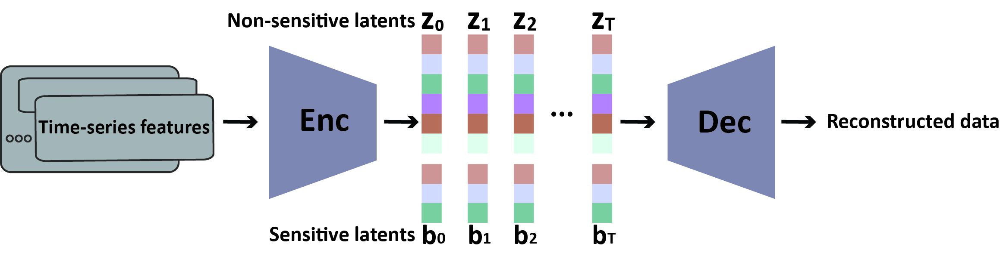

# TIMESPAN 

This is the approach: TIME-Series variaonal autoencoder model for Safeguarding Privacy And fairNess (TIMESPAN) used in our paper [Learning from Time-series EHR](https://arxiv.org/abs/2309.11373). The approach tries to learn a structured latent space from time-series EHR. Such a latent space is composed of two subspaces, sensitive latents and non-sensive latents. The desired properties are: 1. disentanglement (the ability of using sensive latents to predict sensitive labels); and 2. utility (the ability to perform clinical predicon tasks using only nonsensive latents).  The approach can adapt to both point predicon such as in-hospital mortality or time-series predicon such as clinical scores. The latter requires time-series information in the latent space as well. The sensive latents can be discarded or noised out when performing downstream tasks in order to protect the sensive atrributes from being utilized. The results and the detailed training objectives are demonstrated in the paper.  

## Data 
The data needed is the same as that in [Learning_Time_Series_EHR](https://github.com/weiliao97/Learning_Time_Series_EHR) repo. 

###  Case 1: single attribute (0: sex, 1: age, 21: race), SOFA prediction, MIMIV-IV data
	python main.py --epochs 150 --enc_channels 256 128 64 10 --dec_channels 64 128 256 200 --lr 0.0001 --beta 0.001 --checkpoint test --theta 5 --sens_ind 0 --dir_data xxx --dir_save xxx
### Case 2: single attribute,  SOFA prediction, eICU data
	python main.py --enc_channels 256 128 64 10 --dec_channels 64 128 256 200 --lr 0.0001 --beta 0.001 --checkpoint eicu_test --theta 5 -sens_ind 0 --database eicu --dir_data xxx --dir_save xxx
### Case 3: 3 attributes, SOFA prediction, MIMIC-IV data 
switch to branch weighted_multiz 

	python main.py --epochs 150 --enc_channels 256 128 64 10 --dec_channels 64 128 256 200 --lr 0.0001 --beta 0.001 --checkpoint test_multib --dir_data xxx --dir_save xxx

### Case 4: single attribute, IHM task,  MIMIC-IV data 
switch to branch 2d_ihm

	python main.py --epochs 150 --enc_channels 256 64 16 2 --dec_channels 16 64 256 200 --lr 0.0001 --beta 0.001 --checkpoint test_ihm --theta 5 --sens_ind 0--dir_data xxx --dir_save xxx
